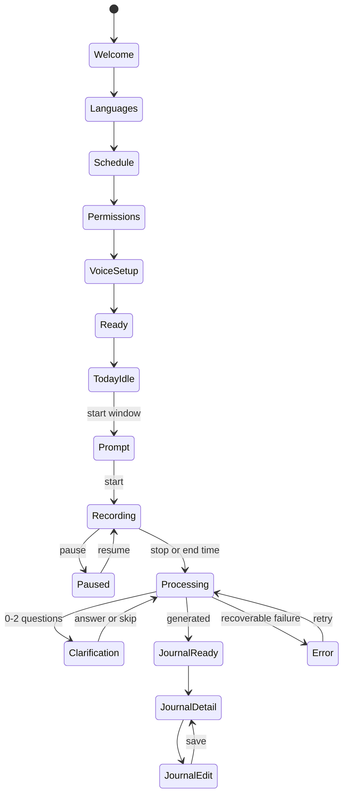

# Daytale Implementation Specification

Status: Sole implementation specification
Visual authority: [prototype/index.html](../prototype/index.html) and [prototype/tokens.css](../prototype/tokens.css), unchanged during documentation work. The historical PNG is non-authoritative.

This document turns [01-PRD](01-PRD.md) and [02-MVP](02-MVP.md) into buildable behavior. If a code-level choice is not stated here, use the existing Expo, React Native, TypeScript, and platform defaults that satisfy the locked product boundary. Any discovered physical-device constraint is recorded in [06-PROGRESS](06-PROGRESS.md), not silently used to expand scope.

## 1. Product shell and screen contract

Daytale has exactly three primary tabs: Today, Journal, and Settings. On first run, onboarding is a linear stack. The following registry covers every prototype state plus the required Voice Setup state. The `prototype/index.html` screen ID is the stable visual reference.

| ID | Screen | Entry | Required content and behavior | Exit or next state |
| --- | --- | --- | --- | --- |
| `welcome` | Welcome | First launch | Mascot, value statement, optional first-name field, Continue | `lang-spoken` |
| `lang-spoken` | Languages | Welcome | Spoken languages (English, Nepali, or both) and journal language; validation prevents empty selection | `schedule` |
| `schedule` | Schedule | Languages or Settings | Start and end time, timezone derived from device, clear daily summary; end must be after start | `privacy-permissions` or Settings Today |
| `privacy-permissions` | Privacy and Permissions | Schedule | Plain-language local-audio and transcript-cloud explanation, microphone and notification permission actions, denial recovery | `voice-setup` after required permissions, or blocked state |
| `voice-setup` | Voice Setup | Permission completion | Three short guided samples, progress, retry/delete, encrypted on-device profile; no skip | `ready` |
| `ready` | Ready | Voice Setup | Setup summary and start-today action; first name and choices are editable later | `today-idle` |
| `today-idle` | Today idle | Ready or Today tab | Next scheduled window, last journal summary or empty state, Start now | `morning-prompt` or `recording` |
| `morning-prompt` | Recording prompt | Notification or Start now | Full-screen prompt with schedule and privacy reminder; Start, Later, and Stop/close affordances | `recording` or `today-idle` |
| `recording` | Recording | Prompt, resume, or scheduled start | Live duration, waveform/mascot state, transcript unavailable while recording, Pause and Stop, system surface parity | `paused`, `processing`, or `today-idle` |
| `privacy-sheet` | Recording privacy sheet | Recording | Bottom sheet explains microphone state and the next cleanup step; no hidden controls | Dismiss to `recording`, or Stop to `processing` |
| `paused` | Paused | Recording Pause | Paused duration, Resume and Stop, explicit indication that no audio is captured | `recording` or `processing` |
| `clarification` | Clarification | Processing | Zero, one, or two time-based timeline cards; answer, skip, and continue actions; no map or location | `processing`/generating, then `journal-ready` |
| `processing` | Processing | Stop, scheduled end, or clarification continue | Stage label (transcribing, analyzing, generating), progress that does not imply false precision, retry/offline explanation | `clarification`, `journal-ready`, or `error` |
| `journal-ready` | Journal ready | Final generation | Journal preview, title, tags, Edit, Share, Done; success state is durable before leaving | `journal-detail`, `journal-edit`, or `today-idle` |
| `journal-list` | Journal list | Journal tab | Chronological cards, search-free MVP list, empty and loading states | `journal-detail` |
| `journal-detail` | Journal detail | Journal list or Journal ready | Full title, paragraphs, time/context tags, Edit, Share, Delete with confirmation | `journal-edit`, list, or `today-idle` |
| `journal-edit` | Journal edit | Detail or ready | Editable title and paragraphs, Save/Cancel, keyboard and unsaved-change handling | `journal-detail` |
| `settings-root` | Settings | Settings tab | Profile, schedule, languages, privacy/data, permissions, about; first name edit | Child settings state |
| `settings-schedule` | Schedule settings | Settings root | Edit start/end, validation, next-run preview, save confirmation | `settings-root` |
| `settings-languages` | Language settings | Settings root | Edit spoken and journal language, explain reprocessing implications, save | `settings-root` |
| `settings-privacy` | Privacy and Data | Settings root | Voice profile status, re-record/delete voice, delete journals, delete all data, permissions links | `settings-root` or confirmed destructive action |
| `error` | Recoverable error | Any failed operation | Human-readable cause, Retry, Go back, and data-retention deadline when relevant; no raw diagnostics | Previous safe state or retry |

Every screen has loading, empty, permission, interruption, offline, and failure behavior appropriate to its action. No screen may trap the user behind a disabled button without an explanation.

## 2. Navigation and state machine

The app uses Expo Router for routes and a Zustand store for session state. A route transition must be derived from persisted state, not only in-memory navigation, so a process restart returns to the correct recovery screen.



The recording session is the source of truth for Today. A scheduled session can be started early only through an explicit Start now action. A paused session never captures audio. A scheduled end is idempotent: repeated timers, notifications, or app resumes cannot create duplicate sessions or generate twice.

## 3. Visual and interaction system

Use the tokens and copy in `prototype/tokens.css` and `prototype/index.html` directly. Do not create a second palette, type scale, mascot set, or copy deck. The implementation must preserve the prototype's Sakura Morning light theme, Night Sakura dark theme, Fredoka/Figtree/Newsreader/IBM Plex Mono font roles, spacing, radii, shadows, static SVG mascot states, and named animation intent.

- Use Reanimated for the prototype's microinteractions. Do not add Rive or Lottie for MVP.
- Respect safe-area insets on every route and keep bottom actions above the home indicator.
- Interactive targets are at least 44 by 44 points on iOS and 48 by 48 dp on Android, including icon-only buttons.
- Focus order follows reading order. Every icon has an accessible label and a visible focus/pressed state.
- Dynamic text must reflow without clipping at the largest supported accessibility size. Do not encode meaning only in color or animation.
- Reduced motion removes looping mascot/waveform motion and uses opacity/state changes. It does not remove status text.
- Keyboard input uses a scrollable inset view, preserves cursor position, and confirms or discards unsaved edits explicitly.
- Dark mode is a semantic theme switch using the prototype token names, not ad hoc per-component colors.

## 4. Mobile architecture

The application uses Expo, React Native, TypeScript, Expo Router, Zustand, Expo development builds, and feature-based organization.

```text
app/
  (onboarding)/        route entries for onboarding screens
  (tabs)/              Today, Journal, Settings route entries
  recording/           recording and processing routes
src/
  features/onboarding/
  features/schedule/
  features/recording/
  features/transcription/
  features/speaker/
  features/journal/
  features/settings/
  components/          shared visual primitives only
  state/               Zustand slices and selectors
  storage/             SQLCipher repositories and SecureStore key access
  services/            platform adapters and journal API client
  theme/               prototype token mapping
  test/                fixtures, factories, and test utilities
```

Feature code owns its routes, components, hooks, validation, persistence calls, and tests. Shared code is limited to cross-feature primitives and platform adapters. The app layer never calls Gemini directly.

### Platform adapters

- `expo-audio` starts and controls background recording and provides the Android microphone foreground service. Add native Swift/Kotlin only when a physical-device test demonstrates a missing capability, and record the reason in progress.
- SQLCipher is provided through `expo-sqlite`; the database key is generated once and stored in SecureStore. The key is never logged or serialized into normal preferences.
- iOS Live Activity and Android foreground notification actions call the same idempotent session commands as the in-app controls.
- Native share uses the platform share sheet and exports only the user-selected journal text.

Authoritative references: [Expo Audio](https://docs.expo.dev/versions/latest/sdk/audio/), [Expo SQLite](https://docs.expo.dev/versions/v54.0.0/sdk/sqlite/), and [Firebase App Check custom resources](https://firebase.google.com/docs/app-check/web/custom-resource).

## 5. Local data model

All records have a UUID primary key and `createdAt`/`updatedAt` timestamps in UTC. Dates shown to users use the saved device timezone for that session. Repositories validate records at their boundary and use transactions for lifecycle changes.

### `AppPreferences`

`id`, `firstName?`, `spokenLanguages[]` (English/Nepali), `journalLanguage`, `scheduleStartLocal`, `scheduleEndLocal`, `timezone`, `notificationsEnabled`, `microphonePermissionState`, `onboardingComplete`, `theme`, `reducedMotion`, `createdAt`, `updatedAt`.

### `VoiceProfile`

`id`, `status` (`pending`, `ready`, `deleted`), `sampleCount` (0-3), `encryptedEmbeddingBlob`, `modelVersion`, `createdAt`, `updatedAt`, `deletedAt?`. Embeddings remain encrypted on device and are never sent to the journal API.

### `RecordingSession`

`id`, `scheduledStart`, `scheduledEnd`, `actualStart?`, `actualEnd?`, `timezone`, `status`, `pauseIntervals[]`, `lastRecoveredChunkId?`, `failureCode?`, `retryUntil?`, `createdAt`, `updatedAt`.

`status` is one of `scheduled`, `recording`, `paused`, `transcribing`, `analyzing`, `awaiting clarification`, `generating`, `ready`, `failed`, `expired`, or `discarded`. Transitions are validated by a single reducer and persisted atomically.

### `AudioChunk`

`id`, `sessionId`, `sequence`, `startedAt`, `endedAt?`, `codec`, `sampleRate`, `encryptedPath`, `sha256`, `state` (`active`, `closed`, `transcribed`, `deleted`), `deleteAfter`, `createdAt`.

Chunks are compressed mono audio in the protected app sandbox. A closed chunk is encrypted before it is eligible for processing. After a crash, only the active chunk is recovered; an incomplete chunk is marked discarded if integrity cannot be proven.

### `TranscriptSegment`

`id`, `sessionId`, `chunkId`, `startMs`, `endMs`, `text`, `language`, `speaker` (`user`, `other`, `unknown`), `speakerConfidence`, `transcriptConfidence`, `createdAt`.

### `ExtractedEvent`

`id`, `sessionId`, `startMs`, `endMs`, `kind`, `summary`, `evidenceSegmentIds[]`, `speaker`, `confidence`, `supported`, `createdAt`.

### `ClarificationQuestion` and `ClarificationAnswer`

Question: `id`, `sessionId`, `startMs`, `endMs`, `question`, `reason`, `status` (`open`, `answered`, `skipped`), `createdAt`.
Answer: `id`, `questionId`, `answerText`, `createdAt`.

Questions are time-based and may reference a transcript interval, never a place pin. There can be at most two open questions per session.

### `JournalEntry`

`id`, `sessionId`, `date`, `timezone`, `title`, `paragraphs[]`, `contextTags[]`, `sourceEventIds[]`, `language`, `editedAt?`, `createdAt`, `updatedAt`.

### `CleanupReceipt`

`id`, `sessionId?`, `reason` (`success`, `expired`, `discarded`, `user_deleted`), `deletedKinds[]`, `completedAt`, `contentFreeHash`.

Cleanup receipts contain no transcript, journal, filename, name, or free text. They exist to prove deletion work without retaining content.

## 6. Recording, transcription, and speaker lifecycle

1. The scheduler creates one `scheduled` session using the saved timezone and local start/end.
2. Start validates microphone permission, available storage, and a `ready` voice profile. It opens a mono compressed recording and moves to `recording`.
3. Rotate chunks on a bounded interval selected and documented by the recording spike. Close, hash, encrypt, and persist each chunk before opening the next.
4. Pause closes the active chunk, persists a pause interval, and stops capture. Resume opens a new sequence. Stop and scheduled end close the final chunk and move to `transcribing`.
5. whisper.cpp, through a React Native binding selected and pinned during DYT-007, transcribes locally with timestamps and language tags. Language may switch within a segment set.
6. sherpa-onnx compares speech embeddings with the encrypted enrolled profile. Attribution thresholds are calibrated on multiple-speaker fixtures. Below threshold, use `unknown`.
7. Delete each audio chunk after its transcript is durable. If transcription, analysis, or generation fails, retain only encrypted retry material until `retryUntil` (maximum 24 hours).
8. After final journal save, delete transcripts, extracted events, and clarification data in one transaction and append a content-free cleanup receipt.

Incoming calls, Bluetooth route changes, microphone route loss, low storage, app termination, and OS interruptions must produce a persisted state and user-facing recovery action. They must never silently resume capture without explicit state reconciliation.

## 7. Journal API and Gemini pipeline

The Cloud Run service is stateless. It authenticates Firebase App Check, validates size and schema, never logs request or response bodies, and persists nothing. The service is the only place that uses the Gemini key.

### `POST /v1/journal/analyze`

Request:

```json
{
  "date": "2026-09-25",
  "timezone": "Australia/Sydney",
  "segments": [
    {"id": "segment-id", "startMs": 1200, "endMs": 5200, "text": "...", "language": "en", "speaker": "user", "confidence": 0.96}
  ],
  "journalLanguage": "en"
}
```

Response:

```json
{
  "events": [
    {"startMs": 1200, "endMs": 5200, "kind": "moment", "summary": "Supported summary", "evidenceSegmentIds": ["segment-id"], "speaker": "user", "confidence": 0.9}
  ],
  "questions": [
    {"startMs": 1200, "endMs": 5200, "question": "What would you like to remember about this moment?", "reason": "missing_context"}
  ]
}
```

The API returns no more than two questions. Events without evidence IDs, events attributed to `user` without user speaker evidence, unsupported places, invented people, and unsupported feelings fail schema or policy validation.

### `POST /v1/journal/generate`

Request:

```json
{
  "date": "2026-09-25",
  "timezone": "Australia/Sydney",
  "journalLanguage": "en",
  "events": [{"kind": "moment", "summary": "Supported summary", "evidenceSegmentIds": ["segment-id"], "speaker": "user"}],
  "answers": [{"questionId": "question-id", "answerText": "Optional context"}]
}
```

Response:

```json
{
  "title": "A grounded title",
  "paragraphs": ["A factual paragraph grounded in the supplied events."],
  "contextTags": ["work", "reflection"]
}
```

The service uses `gemini-3.8-flash` with structured JSON output and medium reasoning. Grounding and caching are disabled. Prompts treat transcript text as untrusted content, so prompt-injection instructions inside speech are quoted as content and never become policy. The model may summarize, not add facts. The mobile app validates the response again before saving.

References: [Gemini models](https://ai.google.dev/gemini-api/docs/models), [structured output](https://ai.google.dev/gemini-api/docs/structured-output), [zero data retention](https://ai.google.dev/gemini-api/docs/zdr), and [API-key security](https://ai.google.dev/gemini-api/docs/api-key).

### HTTP behavior

- `401` or `403`: missing/invalid App Check; do not retry silently.
- `400`: malformed or unsupported schema; show a recoverable error and retain encrypted retry material.
- `413`: oversized request; split only at a segment boundary if the local policy permits, otherwise show a clear failure.
- `429`, `408`, `5xx`, or network failure: exponential retry while before `retryUntil`, then offline/expired state.
- All responses include a request ID that is content-free. No body, transcript, prompt, or journal text is logged.

## 8. Security, privacy, and deletion

- SecureStore holds the SQLCipher database key and any platform credentials needed for App Check. Key access is least-privilege and failures fail closed.
- Audio file paths are opaque UUID paths under the protected sandbox. Closed chunks are encrypted before processing.
- App Check tokens are attached by the API client and refreshed through the supported Firebase flow. Gemini credentials never ship to the app.
- The app redacts diagnostics to route, state, error code, duration, OS version, and app version. It excludes names, audio, transcripts, embeddings, journal text, and custom behavioral analytics.
- Delete journal removes the journal and its source receipt reference but never silently removes another journal.
- Delete voice removes the encrypted embedding and sample metadata; the next recording requires three new samples.
- Delete all data confirms the irreversible operation, stops an active session, removes all content and preferences, removes the database key, and leaves only the minimum platform-level app state. Reopening starts onboarding.
- Expiry cleanup warns before `retryUntil`, deletes encrypted chunks and transient records, and writes a content-free `CleanupReceipt`.

## 9. Offline and failure recovery

The app remains navigable offline. Existing journals and settings are readable. Recording and local transcription may continue. Analysis and generation enter a queued state and retry when connectivity returns. The Today screen shows the session state, next retry window, and expiry deadline without exposing content in a notification.

Permission denial presents the system settings path and a retry action. A missing voice profile blocks recording with a direct link to Voice Setup. Low storage stops capture safely and points to cleanup. A crash restores only the active chunk and persisted state. A duplicate retry is rejected by session ID and operation idempotency. After expiry, the user can start a new session; expired material cannot be recovered.

## 10. Test and verification specification

### Automated tests

- Unit: state reducer transitions, schedule calculations across midnight and DST, pause intervals, chunk expiry, cleanup deadlines, schema validation, payload limits, and conservative attribution.
- Component: every screen action, permission denial, empty state, loading state, inline confirmation, destructive confirmation, keyboard path, reduced-motion rendering, and accessibility label.
- API contract: valid output, malformed output, missing evidence, prompt-injection transcript text, unsupported facts, maximum two questions, App Check rejection, retry status codes, oversized payloads, and log redaction.
- E2E on both platforms: onboarding, scheduling, start, pause, resume, stop, automatic end, interruption, clarification, generation, edit, share, journal delete, voice delete, all-data delete, offline queue, and recovery.
- Documentation: internal links, unique requirement ownership, all stories linked to a ticket, all prototype IDs covered, and no unresolved placeholders.

### Physical-device matrix

Run on iOS 17+ and Android 12+ with evidence attached to the relevant ticket: eight-hour session, screen lock, backgrounding, incoming call, Bluetooth connect/disconnect, microphone route loss, low storage, app termination, offline processing, network recovery, notification action controls, dark mode, large text, reduced motion, keyboard, safe areas, and minimum touch targets.

Fixtures include English, Nepali, mixed-language speech, multiple speakers, overlapping speech, silence, low confidence, and prompt-injection wording. The expected decision for ambiguous attribution is `unknown`.

### Deletion proof

Tests must prove that audio disappears after successful transcription, transient transcripts/events/questions disappear after journal save, expired retry material disappears after 24 hours, and journals/preferences/voice profile/content-free cleanup receipts remain until explicitly deleted. Assertions inspect the encrypted database and sandbox file inventory without printing content.
